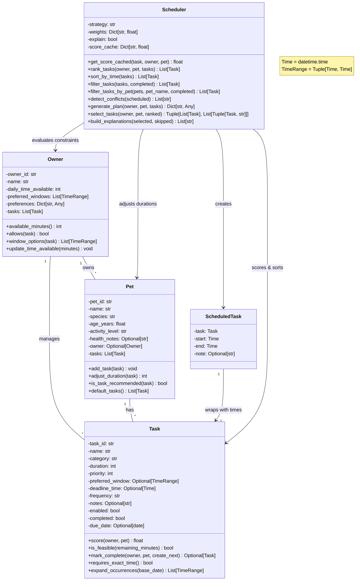

# PawPal+ UML Class Diagram



## Key Class Relationships

### 1. **Task**
- **Responsibility**: Represents a single pet care activity
- **Key Methods**:
  - `score()`: Calculates priority considering owner preferences and pet suitability
  - `is_feasible()`: Checks if task fits in remaining time
  - `mark_complete()`: Marks task done and creates next occurrence if recurring
  - `expand_occurrences()`: Generates candidate time slots

### 2. **Owner**
- **Responsibility**: Represents the pet owner with constraints
- **Key Methods**:
  - `allows()`: Enforces owner preferences (e.g., no late walks)
  - `window_options()`: Finds time slots matching both owner and task preferences
  - `available_minutes()`: Returns daily time budget
- **Relationships**:
  - Owns 1+ Pets
  - Has 1+ Tasks in global list

### 3. **Pet**
- **Responsibility**: Represents a single pet with species/age-based constraints
- **Key Methods**:
  - `adjust_duration()`: Modifies task duration based on pet age/activity
  - `is_task_recommended()`: Species-specific filtering (e.g., walks for dogs only)
  - `default_tasks()`: Generates standard tasks for new pets
- **Relationships**:
  - Belongs to 1 Owner
  - Has 1+ Tasks

### 4. **ScheduledTask**
- **Responsibility**: Wraps a Task with concrete start/end times
- **Role**: Output of the scheduler
- **Relationship**: Converts abstract Task into concrete Time slots

### 5. **Scheduler**
- **Responsibility**: Orchestrates the scheduling algorithm
- **Strategy**: Greedy first-fit algorithm
- **Key Methods**:
  - **Ranking**: `rank_tasks()` - scores tasks by priority
  - **Sorting**: `sort_by_time()` - orders chronologically
  - **Filtering**: `filter_tasks()`, `filter_tasks_by_pet()` - excludes tasks
  - **Planning**: `generate_plan()` - builds complete schedule
  - **Conflict Detection**: `detect_conflicts()` - finds overlaps
  - **Scoring**: `get_score_cached()` - caches priority scores

## Design Patterns Used

1. **Dataclass Pattern**: All core classes use `@dataclass` for clean initialization
2. **Strategy Pattern**: Scheduler supports different `strategy` values
3. **Caching Pattern**: `score_cache` optimizes repeated scoring
4. **Factory Pattern**: `default_tasks()` creates standard tasks
5. **Template Method**: `generate_plan()` uses ranking, filtering, and window selection

## Data Flow

```
User Input
    ↓
Owner + Pets + Tasks
    ↓
Scheduler.generate_plan()
    ├─ rank_tasks() → sorted by priority
    ├─ filter_tasks() → remove impossible
    ├─ detect_conflicts() → check overlaps
    ├─ select_tasks() → time-feasible subset
    └─ generate plan → ScheduledTask list
    ↓
Output: Scheduled + Skipped + Conflicts
```

## Constraints & Validations

- **Owner**: Enforces preferences (no_grooming_weekdays, avoid_late_walks)
- **Pet**: Species rules (dogs get walks, cats don't)
- **Task**: Must be enabled, fit in remaining time, match pet/owner preferences
- **Scheduler**: Detects conflicts when times overlap

## Type Aliases

- `Time = datetime.time`
- `TimeRange = Tuple[Time, Time]`

